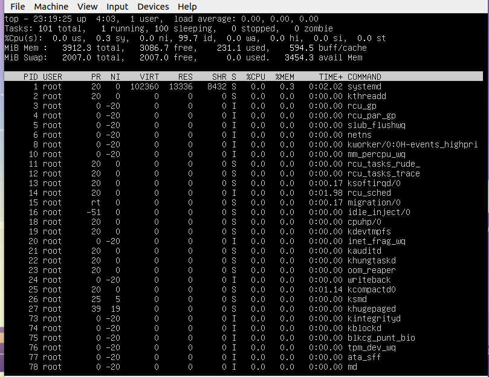
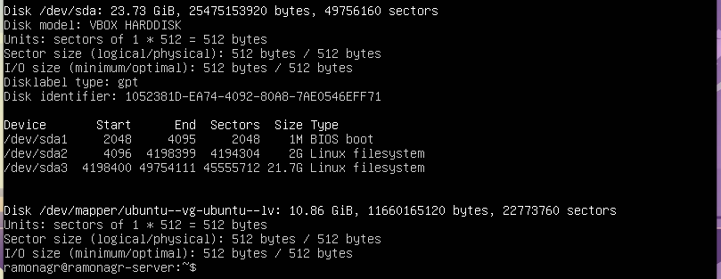
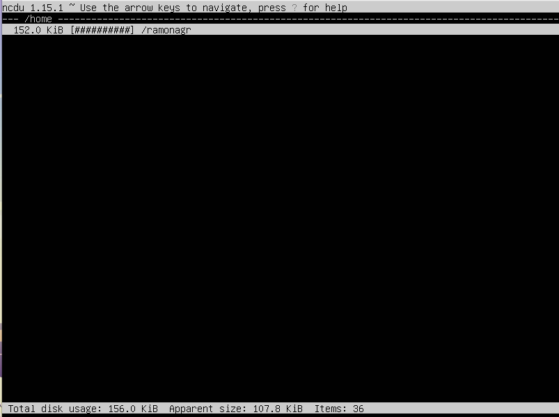

## Part 1. Установка ОС

- ``версия Ubuntu после установки `` 
 

---

## Part 2. Создание пользователя

- ``скриншот вызова команды для создания пользователя `` 
.png "Optional Title") 

- ``пользователь должен быть в выводе команды cat /etc/passwd `` 
.png "Optional Title") 

---

## Part 3. Настройка сети ОС
- ``название машины вида user-1`` 
.png "Optional Title") 

- ``временная зона, соответствующая текущему местоположению`` 
.png "Optional Title") 

- ``название сетевых интерфейсов с помощью консольной команды`` 
.png "Optional Title") 

Интерфейс lo в Linux - виртуальный loopback интерфейс, используемый для локальной коммуникации между процессами на одной машине. Он ассоциируется с IP-адресом 127.0.0.1 и обеспечивает прозрачное тестирование сетевых приложений без воздействия на реальную сеть.

- ``используя консольную команду получил ip адрес устройства, на котором работаю, от DHCP сервера`` 
.png "Optional Title") 

DHCP (Dynamic Host Configuration Protocol) - протокол автоматической настройки сети, предоставляющий устройствам IP-адреса и другие сетевые параметры без необходимости ручной настройки.

- ``вывод внешнего ip-адрес шлюза (ip)`` 
).png "Optional Title") 

- ``внутренний IP-адрес шлюза`` 
).png "Optional Title") 

- ``задаю статичные настройки ip, gw, dns`` 
).png "Optional Title") 
).png "Optional Title") 
).png "Optional Title") 

- ``Перезагрузка. Проверяем, статичные сетевые настройки (ip, gw, dns)`` 
).png "Optional Title") 
).png "Optional Title") 

- ``Ping 1.1.1.1, ya.ru`` 
).png "Optional Title") 

## Part 4. Обновление ОС

``Обновление системных пакетов до последней на момент выполнения задания версии``  
.png "Optional Title") 

## Part 5. Использование команды sudo

``Разрешить пользователю, созданному в Part 2, выполнять команду sudo``  
.png "Optional Title") 

``Смена hostname от юзера s21ramonagr``  
.png "Optional Title") 

## Part 6. Установка и настройка службы времени
``Настройка службы автоматической синхронизации времени``  
Вывод команды должен содержать NTPSynchronized=yes: timedatectl show  
Cкрины с корректным временем и выводом. 
 

## Part 7. Установка и использование текстовых редакторов
``VIM Выход+save esc -> : -> wq``  
.png "Optional Title") 

``NANO Выход+save ctrl+x -> y -> enter``  
.png "Optional Title") 

``MCEDIT Выход+save F2 (save) -> F10 (exit)``  
.png "Optional Title") 

``VIM Выход esc -> : -> q!``  
).png "Optional Title") 

``NANO Выход ctrl+x -> n -> enter``  
).png "Optional Title") 

``MCEDIT Выход F10 -> n``  
).png "Optional Title") 

``VIM Поиск esc -> / -> 21 (optional)``  
).png "Optional Title") 

``VIM Замена esc -> :s/21/ramonagr/ -> enter (optional)``  
).png "Optional Title") 

``NANO Поиск ctrl+w -> write search -> enter``  
).png "Optional Title")  

``NANO Замена ctrl+w -> ctrl+r -> write what to change -> enter -> write word -> enter -> Y``  
).png "Optional Title") 

``MCEDIT Поиск F7 -> write -> press ok ``  
).png "Optional Title")  

``MCEDIT Замена F4 -> write x2 -> press ok -> press confirm ``  
).png "Optional Title")  

## Part 8. Установка и базовая настройка сервиса SSHD
Установка  
sudo apt install openssh-server  

Автостарт службы  
sudo systemctl start ssh.service  
sudo systemctl enable ssh.service  

Перенастройка службы SSHd на порт 2022  
sudo vim /etc/ssh/sshd_config  
Port 2022 :wq  

Отобразил наличие процесса  
ps -e | grep ssh  
ps - выводит сведения о процессах в статическом виде  
-e - позволяет выбрать все процессы  
| grep sshd - поиск по выводу  

netstat -tan  
  

-tan:  
-t - Отображать TCP подключения  
-a - Показывать состояние всех сокетов; обычно сокеты, используемые серверными процессами, не показываются.  
-n - Показывать сетевые адреса как числа. netstat обычно показывает адреса как символы.  

Proto - Содержит тип протокола  
Recv-Q - Счётчик байтов не скопированных программой пользователя из этого сокета.  
Send-Q - Счётчик байтов, не подтверждённых удалённым узлом.  
Local Address - Адрес и номер порта локального конца сокета.  
Foreign Address - Адрес и номер порта удалённого конца сокета.  
State - Состояние сокета.  
LISTEN Сокет ожидает входящих подключений.  
Time_WAIT в TCP указывает на ожидание завершения всех пакетов для сокета после закрытия соединения, обеспечивая правильное завершение и предотвращая повторное использование адреса и порта.  

## Part 9. Установка и использование утилит top, htop

Установка и запуск:
sudo apt install htop   
top, htop

  
uptime - 4:03   
количество авторизованных пользователей - 1 user   
общую загрузку системы - load average: 0.00, 0.00, 0.00   
общее количество процессов - 101 total   
загрузку cpu - 0.0us, 0.3 sy, 0.0 ni   
загрузку памяти - 3912.3 total, 3086.7 free, 231,1 used   
pid процесса занимающего больше всего памяти (shift + M) - 652   
pid процесса, занимающего больше всего процессорного времени (shift + P) - 2480   

htop отсортированному по PID  
.png "Optional Title")  
htop отсортированному по PERCENT_CPU  
.png "Optional Title")  
htop отсортированному по PERCENT_MEM  
.png "Optional Title")  
htop отсортированному по TIME  
.png "Optional Title")  
htop отфильтрованному для процесса sshd   
.png "Optional Title")  
htop с процессом syslog, найденным, используя поиск
.png "Optional Title")  
htop с добавленным выводом hostname, clock и uptime
.png "Optional Title")  

## Part 10. Использование утилиты fdisk
команда fdisk -l 
  
название жесткого диска - /dev/sda   
размер - 23,73 GB  
количество секторов - 49756160  
размер swap - 2G  

## Part 11. Использование утилиты df

для корневого раздела (/):  
.png "Optional Title")  
размер раздела - 11101392  
размер занятого пространства - 5425992  
размер свободного пространства - 5089672  
процент использования - 52  

Единица измерения в выводе - байты  

df -Th  
.png "Optional Title")  
размер раздела - 11G  
размер занятого пространства - 5,2G  
размер свободного пространства - 4,9G  
процент использования - 52  
тип файловой системы для раздела - ext4

## Part 12. Использование утилиты du
размер папки /home  
.png "Optional Title")  
размер папки /var  
.png "Optional Title")  
размер папки /var/log  
.png "Optional Title")  

Размер всего содержимого в /var/log (не общее, а каждого вложенного элемента, используя *)  
.png "Optional Title")  

## Part 13. Установка и использование утилиты ncdu
размер папки /home  
  
размер папки /var  
.png "Optional Title")  
размер папки /var/log  
.png "Optional Title")  

## Part 14. Работа с системными журналами
/var/log/auth.log  
  
время последней успешной авторизации - 00:57:24  
имя пользователя - ramonagr  
метод входа в систему - LOGIN   

Перезапуск службы SSHd   
.png "Optional Title")  

## Part 15. Использование планировщика заданий CRON
Список текущих заданий crontab  
.png "Optional Title")  

В системном журнале строчки о выполнении  
.png "Optional Title")  

Удалить все задачи  
.png "Optional Title")  